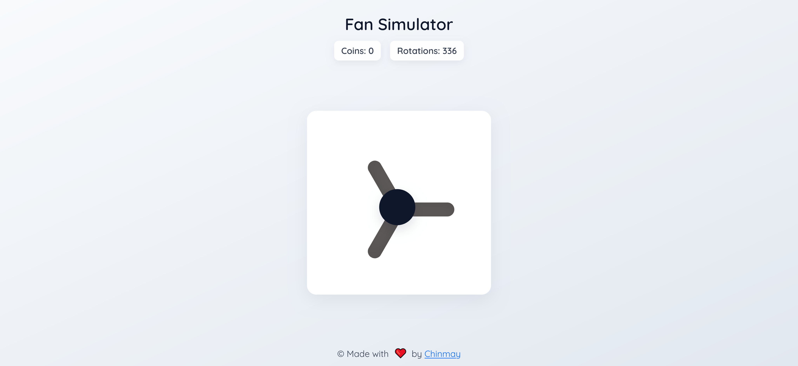
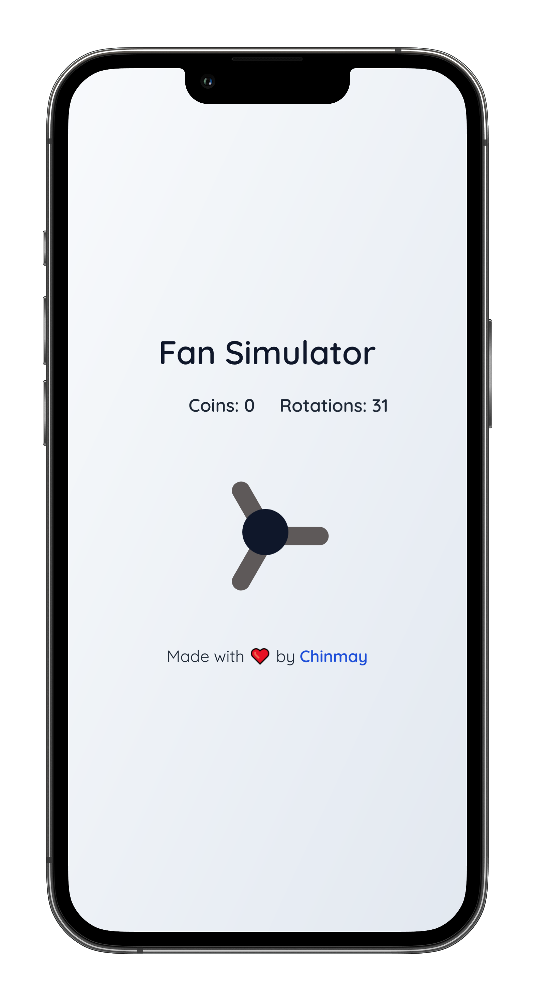
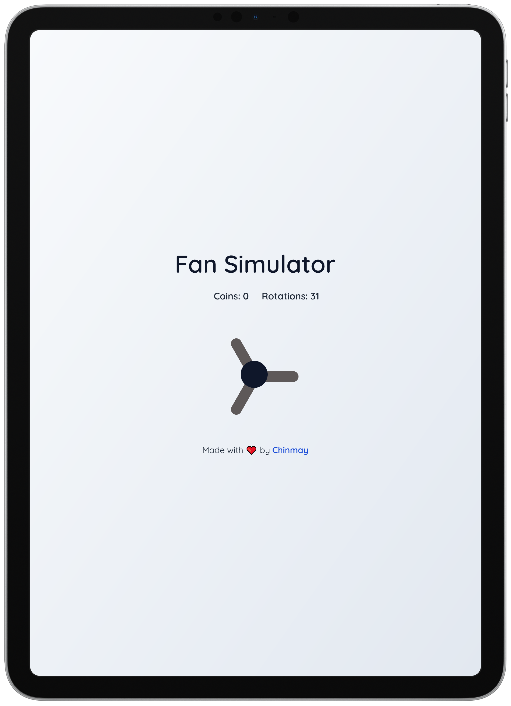

# 🌀 Ceiling Fan Simulator

An interactive ceiling fan simulation game built using **HTML**, **CSS**, and **JavaScript** — complete with sounds, animations, coin rewards, and repair mechanics!

> ⚙️ Rotate the fan, earn coins, and repair it when it breaks — either by **holding the fan** or **spending your coins**.



---

## 🚀 Features

- 🎮 **Click to spin** the fan and earn coins.
- 🔁 **Every 5 rotations**, the fan breaks.
- ⚠️ Get **warning messages** as the fan weakens (every 2nd rotation).
- 🪙 **Repair options**:
  - Hold-click the fan for 5 seconds.
  - Spend 10 coins to auto-repair.
- 🎨 Responsive UI with smooth animations and a modern gradient background.

---

## 🛠️ Tech Stack

- **HTML5**
- **CSS3**
- **JavaScript (Vanilla)**
- [Bootstrap 5](https://getbootstrap.com/)
- [Google Fonts - Quicksand](https://fonts.google.com/specimen/Quicksand)

---

## 📸 Screenshots

| Desktop | Mobile | Tablet |
|-------------|----------|--------------------------|
|  |  |  |


---

## 📂 Project Structure

```bash
📁 Ceiling-Fan-Simulator/
├── index.html        # Main HTML structure
├── style.css         # All styles and responsive design
├── script.js         # Game logic, interaction, repair system
├── fan-working.mp3   # Fan spinning sound
├── fan-repairing.mp3 # Looping repair sound
├── fan-repair-done.mp3 # Repair complete sound
└── README.md         # This documentation
