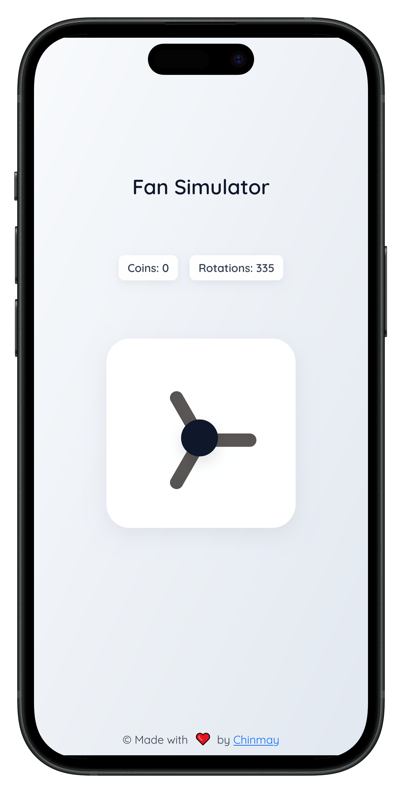
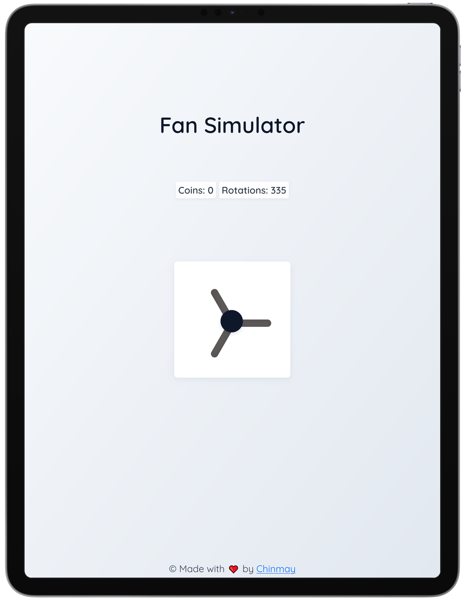

# 🌀 Ceiling Fan Simulator

An interactive ceiling fan simulation game built using **HTML**, **CSS**, and **JavaScript** — complete with **sounds, animations, coin rewards, haptic feedback**, and a **realistic repair system**!

> ⚙️ Spin the fan to earn coins, but beware — it will eventually break! Repair it by **holding the fan** or **spending coins** while enjoying smooth animations and immersive sound effects.


---

## 🚀 Features

- 🎮 **Click or tap to spin** the fan and earn coins.
- 🔁 **Break system**:  
  - Fan breaks after **5, 10, 15... rotations**.  
- 🪙 **Two repair options**:
  - **Hold to Repair** — Press and hold the fan (works on desktop & mobile) for 5 seconds to repair.
  - **Pay to Repair** — Spend **10 coins** for an auto-repair with wobble animation and realistic timing.
- 🎨 **Modern, responsive UI**:
  - Smooth animations.
  - Bootstrap-based responsive layout.
- 📱 **Mobile-friendly**:
  - Touch support.
  - **Haptic feedback** for key actions.
- 🔊 **Dynamic audio system**:
  - Fan sound plays only while spinning.
  - Repair sound loops until repair finishes.
  - Repair complete sound at the end.

---

## 🛠️ Tech Stack

- **HTML5**
- **CSS3**
- **JavaScript (Vanilla)**
- [Bootstrap 5](https://getbootstrap.com/)
- [Google Fonts - Quicksand](https://fonts.google.com/specimen/Quicksand)

---

## 📸 Screenshots

| Desktop | Mobile | Tablet |
|---------|--------|--------|
|  |  |  |

---


## 📂 Project Structure

```bash
📁 Ceiling-Fan-Simulator/
├── index.html             # Main HTML structure
├── style.css              # All styles and responsive design
├── script.js              # Game logic, interaction, repair system
├── fan-working.mp3        # Fan spinning sound
├── fan-repairing.mp3      # Looping repair sound
├── fan-repair-done.mp3    # Repair complete sound
├── screenshot/            # Screenshots for README
└── README.md              # This documentation
---
```

## ❤️ Support Us

If you enjoyed this project, please consider supporting us by giving it a ⭐ on [GitHub](https://github.com/chinmayjha/Fan-Simulator-Game)!

Your support helps us keep improving and adding new features. 🙌
